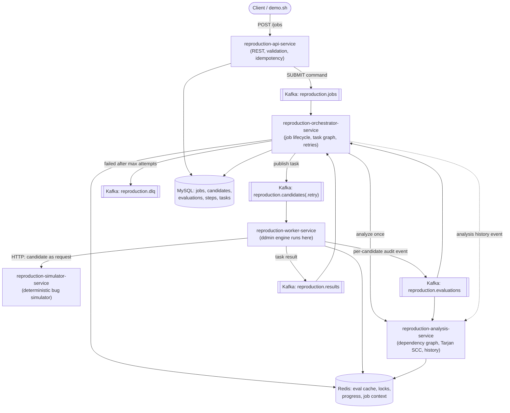

# Architecture

## Services and their boundaries

## Why five services and not one

The prompt's constraint — *"do not make this a fake microservice project where each service only
performs CRUD"* — shapes the boundaries:

- **api-service** is deliberately thin. It validates, fingerprints requests for idempotency, and
  publishes a `SUBMIT` command. It never touches the algorithm.
- **orchestrator-service** owns the *task graph*, not the algorithm. It decides "what task should
  exist next" (the primary reduction, then one alternative-minimal-candidate task per hitting-set
  branch — see [ALGORITHM.md](ALGORITHM.md#enumerating-multiple-minimal-reproductions</a>)), and
  owns retries, deadlines, and result assembly. This is genuinely hard because it must be
  idempotent under at-least-once Kafka delivery and survive its own crash (all state in MySQL,
  recovered by `TimeoutSweeper`).
- **worker-service** is where `ReductionEngine` (from `common`) actually runs. It adapts the
  pure-Java engine to real infrastructure: an HTTP `BugOracle` against the simulator, a two-tier
  (in-process + Redis) `EvaluationCache`, Kafka progress events, and a bounded thread pool for
  parallel candidate evaluation.
- **analysis-service** owns the dependency graph (Tarjan SCC, weak components, criticality) as a
  reusable, independently callable capability — the orchestrator calls it once per job, but it's
  also directly queryable (`POST /api/v1/analysis/dependencies`) for ad-hoc "why does field X
  matter" questions. It also owns the Redis-backed *history* (field keep-likelihood across jobs)
  that feeds the `PRIORITY` strategy's ordering.
- **simulator-service** stands in for "production". Its bugs are declarative
  (`Spec`/`BugScenario`, Specification pattern) so new scenarios can be registered over REST
  without a code change, and it supports `X-Chaos` headers to test the worker's failure handling
  end to end.

## Data flow of one job

1. `POST /jobs` → api-service persists `PENDING` job + fields, publishes `SUBMIT` (Kafka key = jobId).
2. orchestrator: `PENDING → ANALYZING`, materialises flattened fields, calls analysis-service once.
3. orchestrator: persists dependencies, `ANALYZING → SEARCHING`, publishes the **primary** task to
   `reproduction.candidates` (Kafka key = taskId, so a job's tasks spread across partitions/workers).
4. a worker consumes the task, loads `JobContext` (Redis, falling back to the orchestrator's
   `/internal/jobs/{id}/context`), runs `ReductionEngine` against the `HttpBugOracle`, publishing
   one `EvaluationEvent` per candidate (audit trail) and finally one `TaskResult`.
5. orchestrator applies the result: if it's a *new* minimal set, it branches into one alternative
   task per element of that set (hitting-set enumeration of other minimal solutions — bounded by
   `maxSolutions` and `maxTasksPerJob`); when no tasks remain outstanding, it assembles the final
   `JobResult` and transitions to `COMPLETED`/`PARTIAL`/`FAILED`.
6. api-service serves `GET /jobs/{id}/result` straight from the `reproduction_job.result_json` column.

## Where the algorithm actually lives

`common` has **no Spring dependency at all** — it's checked at the `ReproductionDemo` main class,
which runs the whole reduction in-process. The worker service's `SearchTaskExecutor` is a thin
adapter: it builds a `FieldUniverse`, `DependencyAnalysis`, `CandidateEvaluator` (wired to Redis +
an HTTP oracle), and calls `ReductionEngine.strategyFor(...).reduce(...)` — the exact same call
`LocalEndToEndTest` makes with an in-process oracle. This is what "the core delta-debugging engine
should be testable as a plain Java component without starting Spring Boot" means in practice.
